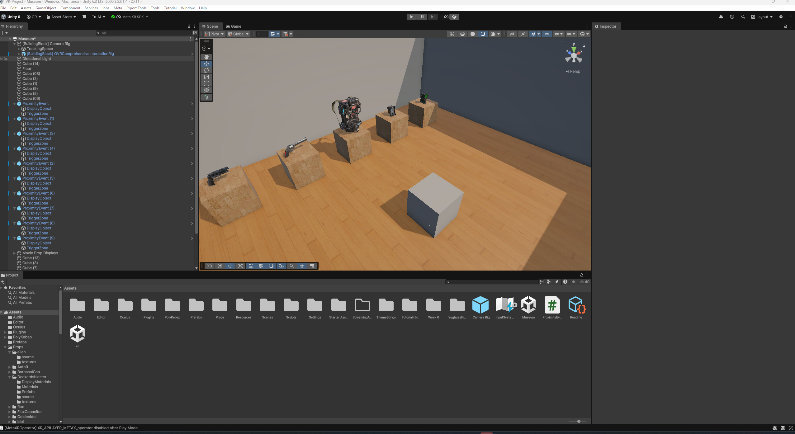
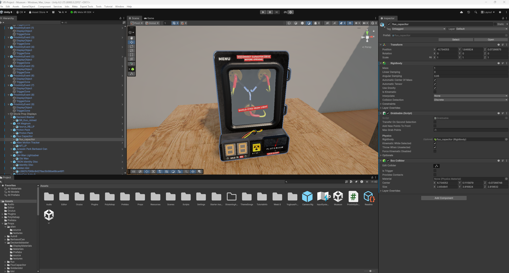
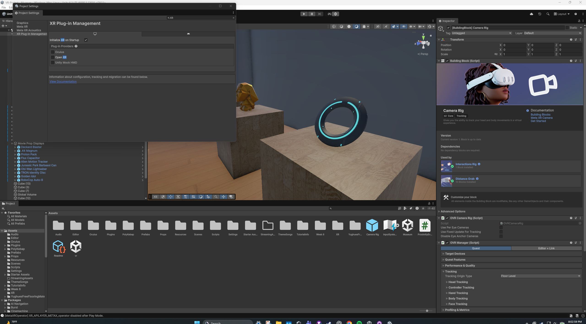

# CSC 461/592 - Assignment 2: VR Movie Prop Museum

## Group 3

Charles Radle, Eli Baird, and Jasper Pham

## Pop Fiction Museum

Our museum has 10 movie prop exhibits, including the Proton Pack, Flux Capacitor, lightsaber, and TRON Identity Disc. We chose movie props because they're fun to explore and show how memorable objects help tell a movie's story.

Visitors can pick up the props with VR controllers, and audio plays when they get close to an exhibit. The museum also keeps track of which exhibits they've visited and shows a completion reward after all 10.

Made with Unity **6000.3.22f1 LTS** and the Meta XR SDK. Open **Assets/Museum.unity** to view the museum.

## Bonuses

- **Bonus 1: 10 exhibitions.**
- **Bonus 3: Visit tracking and a reward for visiting all 10 exhibits.**

## Screenshots

We've tested the scene and grabbing in Meta XR Simulator but a final headset test is still needed.
